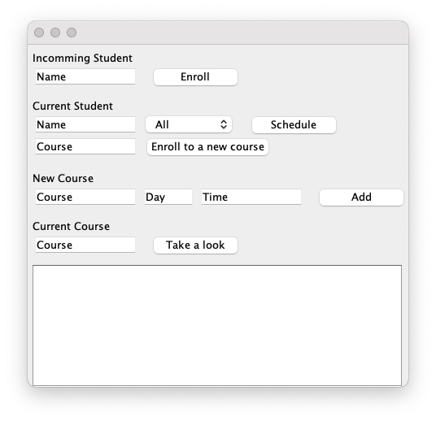

# Enrollment System



This enrollment system is orginally built with Java and MySQL The password is hided for privacy purpose and there is a SQLite version in the folder "TestWithSQLite". To run this:

1. Download the folder "TestWithSQLite"
2. Open the terminal
3. Enter the commend:
    ```
    cd [folder path]
    java -classpath ".:sqlite-jdbc-3.34.0.jar" StudentEnrollment
    ```